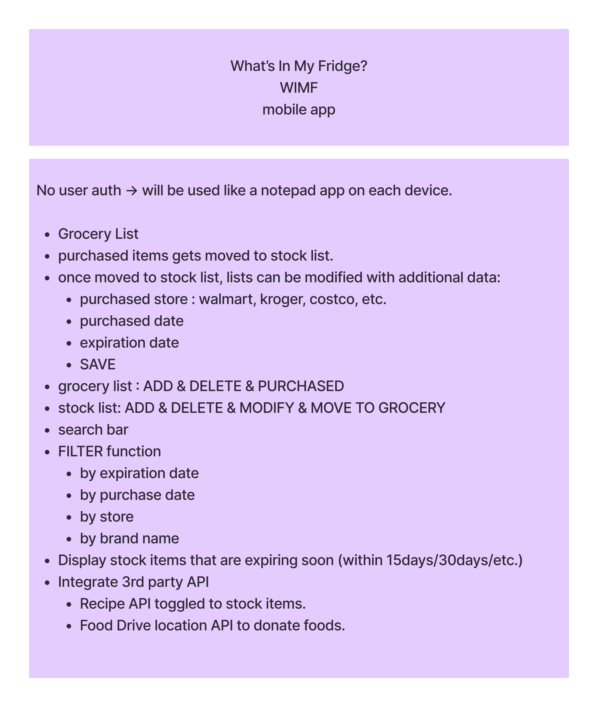

# WIMF
What's In My Fridge is a full MERN stack mobile App that tracks food inside a refrigerator.

<h2>About</h2>
This full-stack MERN (Mongoose/Express/React/Node) application is designed to track food stock inside individual household's freezer and fridge for the purpose of reducing food trash. The expiration date tracker helps the users to use the ingredients before it expires, and prevents from double purchasing foods that are already in stock by keeping record. The 3rd party recipe API helps the users with dish ideas to cook with soon-to-be expired ingredients.

<h2>Key Features</h2>

- **Grocery List**: Grocery List data is easily transferred to My Fridge page once the items are purchased, enabling the tracking from the moment users create a list of what to buy. The list can be added, deleted, and purchased.
- **My Fridge**: Allows users to view a list of items in the fridge at a glance as well as which items are soon to be expired. The lists can be added, deleted, and modified.
- **My Fridge/Search Bar**: Search function allows users to search items by any keywords they wish to search for.
- **My Fridge/Filter**: Users can pull a filtered list of items by filtering items by "expiration date", "purchased date", "store name", or "brand name".
- **Recipe API**: A 3rd party recipe API is linked to each soon-to-be-expired items, which gives the users an idea of what to cook with expiring ingredeints, thus preventing a creation of food trash.
- 
<h2>Branstorming Functionalities</h2>

<h2>Component Hierarchy</h2>

<h2>Entity Relationship Diagram (ERD)</h2>

<h2>Wireframes</h2>

