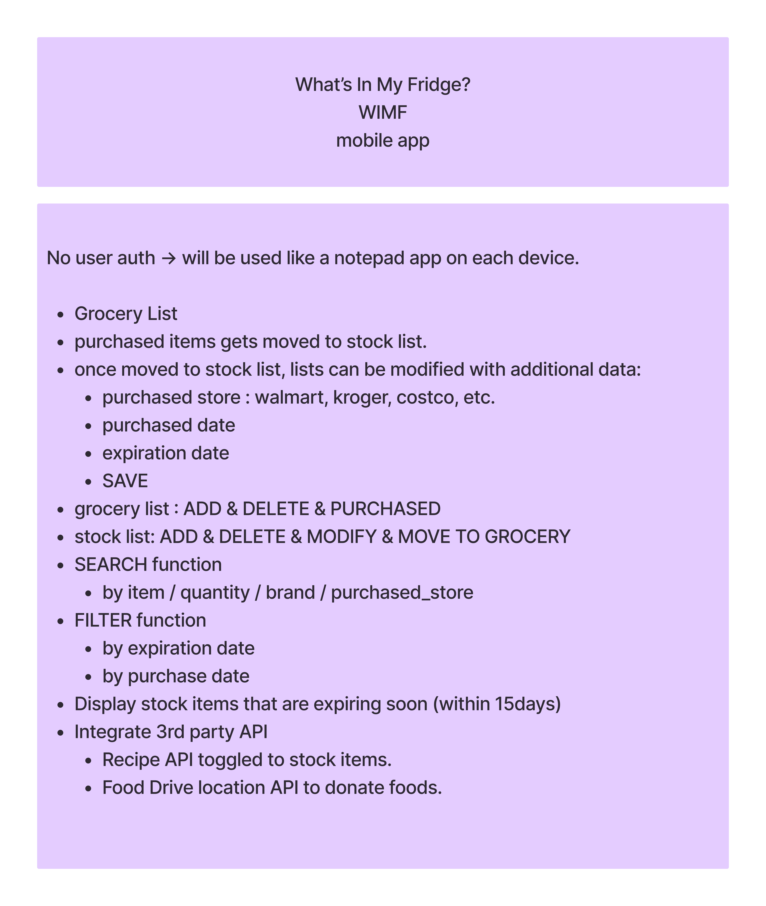

# WIMF
What's In My Fridge is a full MERN stack mobile App that tracks food inside a refrigerator.

<h2>Branstorming Functionalities</h2>

<h2>Component Hierarchy</h2>

<h2>Entity Relationship Diagram (ERD)</h2>

<h2>Wireframes</h2>

